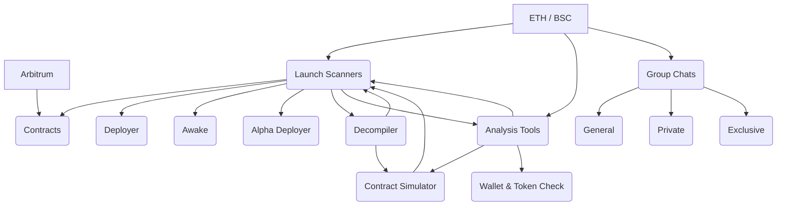

# 👀 Overview

The DeFi-Robot ecosystem is made up of advanced and dynamic interconnected [Launch Scanners](../utilities/launch-scanners/), [Analysis Tools](../utilities/analysis-tools/) and [Group](../utilities/group-chats/) [Chats](../utilities/group-chats/).

<table data-view="cards"><thead><tr><th></th><th></th><th></th><th data-hidden data-card-target data-type="content-ref"></th></tr></thead><tbody><tr><td> <strong>Launch Scanner</strong></td><td>Get alerts on all contract deployments via our various launch scanners.</td><td></td><td><a href="../utilities/launch-scanners/">launch-scanners</a></td></tr><tr><td><strong>Analysis</strong> <strong>Tools</strong></td><td>Discover what functions and utilities lie within the our advanced bots.</td><td></td><td><a href="../utilities/analysis-tools/">analysis-tools</a></td></tr><tr><td><strong>Group Chats</strong></td><td>See what group chats are within the DeFi-Robot ecosystem.</td><td></td><td><a href="../utilities/group-chats/">group-chats</a></td></tr></tbody></table>

