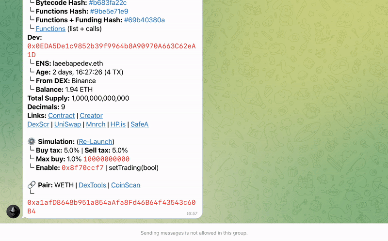

# Quick Simulation


**Re-Launching a quick simulation is useful:**

* to know if there have been any tax changes or developments on open trading methods
* If you see some suspicious TX made by the DEV, you can check to see if taxes, max buy or even dead-blocks have changed


If the contract simulation has run successfully to determine buy/sell taxes, max buy and deadblocks, but has not included the enable trade method, this means that the bot didn't find an enable trade function but could still simulate the token launch by adding LP through Uniswap.

## A light quick simulation of any contract can be done in two ways

### 1. Paste contract address in the DeFi-Robot Simulator

* Select or type **`/start`**
* Paste contract address
* Select **`Quick Simulation`**

Works also after each launch to check if Max Buy is raised or if it turned into a honeypot.

### 2. Select the re-launch in a listing

Tiers 2 and 3 users can use the on-demand`Re-Launch` button to perform a quick simulation on any token listed via it's listing on any of the three listing channels.

<figure><figcaption></figcaption></figure>
