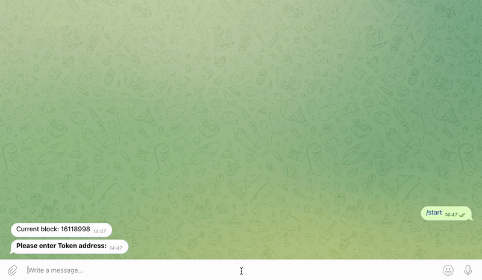

# DeFi-Robot Simulator

This powerful bot can be used as a dashboard to efficiently gather the data needed for method sniping.

## Get started

1. Type **`/start` **&#x20;
2. Paste **contract address**

<figure><figcaption></figcaption></figure>

## Four functions

* [List functions](list-functions.md)
* [Quick Simulator](quick-simulation.md)
* [Liquidity Pool Check](liquidity-pool.md)
* [Advanced Simulation](./#advanced-simulation)


**List Functions, Quick Simulator and LP Check are all implemented within each** [**listings channel**](../../channels/)**.**

Both the quick simulation and liquidity pool check functions are automatically run every time a live listing get's published. What's more, every dynamic live listing can list a contract's functions as well as re-launch the quick simulator in one click.


****
