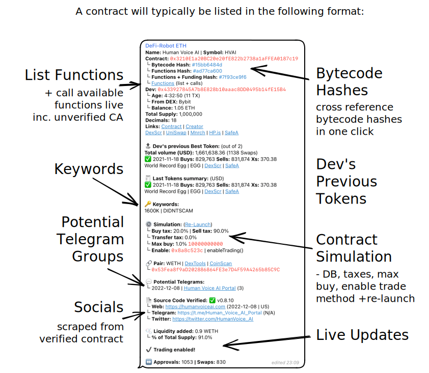

# Channels

## Live and dynamic listing channels

The most impressive part of the DeFi-Robot are the live and dynamic live pairs that come through the three Telegram channel on the Ethereum, Binance Smart Chain and Arbitrum blockchains.

### [ETH/BSC](eth-bsc-contracts.md)&#x20;


Lists all new contracts.


### [ETH/BSC Deployer](eth-bsc-deployer.md)


Lists all new contracts where dev had a previous moonshot >50k.


### [ETH/BSC Awake](eth-bsc-awake.md)&#x20;


Lists previously sleeping contracts which have awoken because of dev activity.


All three will produce a contract listing message which looks like this:

Token, CA, Dev etc.

First section of each listing always contains the token name, contract address and the corresponding trading ticker.

Bytecode hashes 

Included are three hashes all clickable so you can quickly cross-reference previous launches for matching hashes.&#x20;

This is useful to see which past projects with matching hashes were scams and which ones were not.

**1. Bytecode Hash**

Where the bytecode of the contract is hashed.

#### 2. Functions Hash

Where the contract functions list and callable functions are hashed.

#### 3. Functions + Funding Hash

Where the contract functions and the funding source of developer's wallet (Binance, Coinbase, ...) are hashed together.&#x20;

Usually a dev use same DEX so could be useful to find all other contracts, with same hash, from same DEX.

List functions

Click **`functions`** and then **`/start`** on the next page to list all available functions. This works even with unverified contracts on the blockchain.

Developer Wallet

See the developer wallet and where it's funding came from as well as age of wallet.

Tokenomics and links

Here available is the total supply, decimals, and all necessary links about the contract.

 Dev's Previous Launches

Split into two sections:

#### Dev's previous Best Token

* Total volume (swaps)
* Name | Ticker
* Launch date
* Links

#### Last Tokens summary

Lists and summary of last tokens

* Buys | Sells
* Links

Keywords

Quickly get an idea of what to expect with keywords such as:

* DIDN'T SCAM
* 400K
* RUGGED&#x20;

Contract Simulation

The results of the initial contract simulation are returned here where you can find information on:

* Buy and sell taxes
* Deadblocks
* Honeypot status
* Enable trading method

Potential Telegram Groups

This sections provides a list of Telegram groups which could correspond to the token launch.

Socials

This sections automatically parses any socials or websites found within the contract when verified.

Live Updates

Live updates occur for the token listing for up to 12 hours or up until it rugs. Notifications are useful  to see:

* Liquidity added
* How many pre-approvals&#x20;
* When token is live for trading
* How many swaps occurred
* If or when it rugs

****

## **Every tier benefits from the DeFi-Robot Simulator bot**&#x20;

There are three ways the simulator is embedded within each live listing.

1.  ### List functions or re-launch contract simulation in two clicks

    As shown below, within the message received from one of three live listing channels, simply select their respective link to interact with the Simulator Bot.
2. Both the quick simulation and liquidity pool check functions are automatically run every time a live listing get's published.

