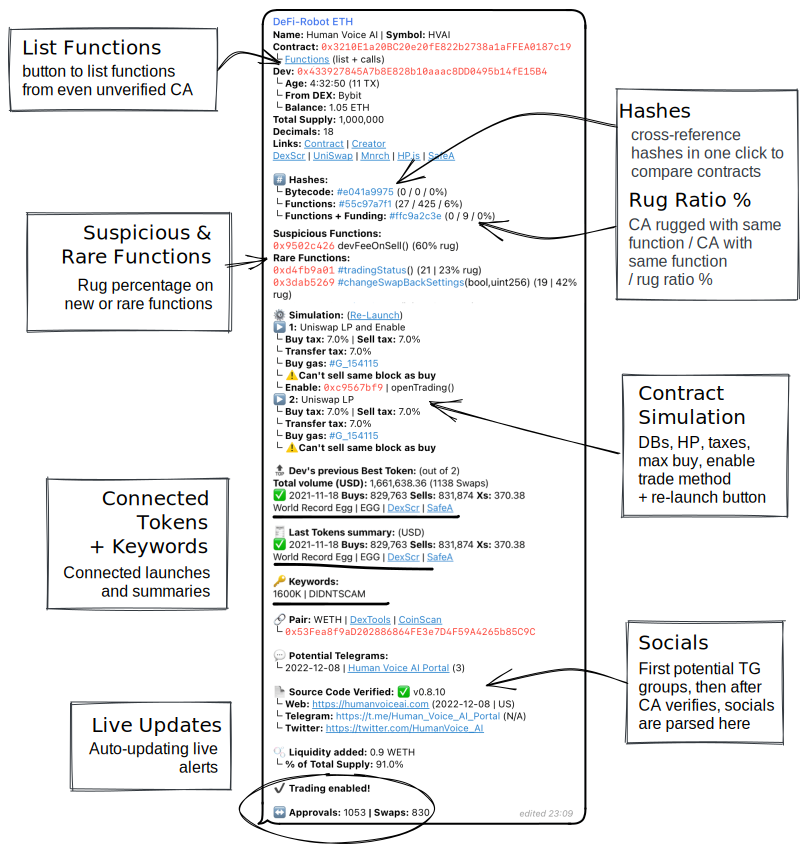

# Launch Scanners

##

## Live and dynamic listing channels of new contract deployments

The most impressive part of the DeFi-Robot are the live and dynamic live contract listings that come through Telegram channels for Ethereum, Binance and Arbitrum blockchains; commonly known in the space as launch scanners.

<table data-view="cards"><thead><tr><th></th><th></th><th></th><th data-hidden data-card-target data-type="content-ref"></th></tr></thead><tbody><tr><td><strong>ETH/BSC Contracts</strong></td><td>Lists all new contracts.</td><td></td><td><a href="eth-bsc-contracts.md">eth-bsc-contracts.md</a></td></tr><tr><td><strong>ETH/BSC Deployer</strong></td><td></td><td>Lists all new contracts where the developer achieved a previous moonshot >50k.</td><td><a href="eth-bsc-deployer.md">eth-bsc-deployer.md</a></td></tr><tr><td><strong>ETH/BSC Awake</strong></td><td></td><td>Lists previously sleeping contracts which have awoken because of recent developer activity.</td><td><a href="eth-bsc-awake.md">eth-bsc-awake.md</a></td></tr><tr><td></td><td></td><td></td><td></td></tr></tbody></table>

## Contracts will be displayed like the example below:&#x20;

## Each listing can include the following

Token information

First section of each listing always contains the token name, contract address and the corresponding trading ticker.

Bytecode hashes 

Included are three hashes all clickable so you can quickly cross-reference previous launches for matching hashes.&#x20;

This is useful to see which past projects with matching hashes were scams and which ones were not.

**1. Bytecode Hash**

Where the bytecode of the contract is hashed.

#### 2. Functions Hash

Where the contract functions list and callable functions are hashed.

#### 3. Functions + Funding Hash

Where the contract functions and the funding source of developer's wallet (Binance, Coinbase, ...) are hashed together.&#x20;

Usually a dev use same DEX so could be useful to find all other contracts, with same hash, from same DEX.

List functions

Click **`functions`** and then **`/start`** on the next page to list all available functions. This works even with unverified contracts on the blockchain.

Developer Wallet

See the developer wallet and where it's funding came from as well as age of wallet.

Tokenomics and links

Here available is the total supply, decimals, and all necessary links about the contract.

 Dev's Previous Launches

Split into two sections:

#### Dev's previous Best Token

* Total volume (swaps)
* Name | Ticker
* Launch date
* Links

#### Last Tokens summary

Lists and summary of last tokens

* Buys | Sells
* Links

Keywords

Quickly get an idea of what to expect with keywords such as:

* DIDN'T SCAM
* 400K
* RUGGED&#x20;

Contract Simulation

The results of the initial contract simulation are returned here where you can find information on:

* Buy and sell taxes
* Transfer tax
* Deadblocks
* Honeypot status
* Enable trading method

Potential Telegram Groups

This sections provides a list of Telegram groups which could correspond to the token launch.

Source Code Verified

This sections automatically parses any social media links or websites found within the contract when it becomes publicly verified by the deveoper.

⚠️ \[Hidden Mint] at \_mint"

It can also include a Hiddent Mint warning; If you see this it's recommended to check the contract. Most of the time it's used to create the initial supply (which is not the official way to do it ...), but could also be used by another function to actually mint after launch.

Most of the time it's used to create a rug pull, even if liquidity is locked.

Live Updates

Live updates occur for the token listing for up to 12 hours or up until it rugs. Notifications are useful  to see:

* Liquidity added
* How many pre-approvals&#x20;
* When token is live for trading
* How many swaps occurred
* If or when it rugs

## How the Simulator Bot works with Launch Scanner


There are numerous ways in which the Simulator Bot is embedded within each live listing of contract deployments


Upon each listing being generated, the Simulator Bot already determines the functions, runs a quick simulation and performs a liquidity check.&#x20;

The DeFi-Robot channel then uses this information to present the initial listing information.

### Dynamic List functions and Re-Lunch button

What's more, the user can interact with the Simulator Bot within each listing to dynamically generate new information.

Within each contract listing the user can list the functions of a contract as well as re-launch the quick contract simulator.

<figure><figcaption></figcaption></figure>

